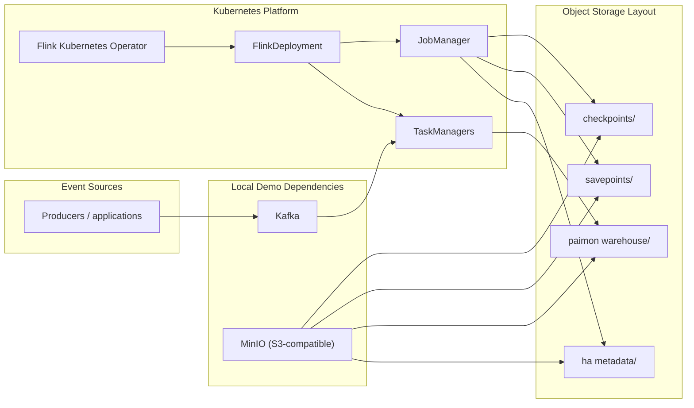

# Flink Streaming Template

## Goal

Provide a runnable local baseline and production-oriented reference architecture for a Kubernetes-native streaming platform centered on:

- `Flink Kubernetes Operator`
- `Kafka` ingestion
- `Paimon` table outputs
- object-storage-backed checkpoints and savepoints

This template is a sibling to the AI scheduler lab, not an extension of it. The scheduler lab explores admission and queueing policy. This template focuses on stream-processing platform packaging and operations.

## Architecture

## Local Demo Path

The local path is optimized for approachability and runs with self-hosted demo assets:

- `Kafka`: single-node KRaft broker in-cluster
- object storage: single-node `MinIO`
- operator runtime: `FlinkDeployment` managed by the Flink Kubernetes Operator
- application values: [templates/flink/values/values.local.yaml](/Users/harpreetsingh/Documents/flink-streaming-infra-template/templates/flink/values/values.local.yaml)

Local storage endpoints are wired like this:

- Kafka bootstrap: `flink-demo-kafka.flink-demo.svc.cluster.local:9092`
- S3 endpoint: `http://flink-demo-minio.flink-demo.svc.cluster.local:9000`
- warehouse bucket path: `s3://paimon-warehouse/warehouse`
- checkpoint bucket path: `s3://flink-state/checkpoints`
- savepoint bucket path: `s3://flink-state/savepoints`

## Production Path

The production path keeps the same logical architecture but swaps in durable managed services:

- managed or externally operated Kafka
- durable cloud object storage for checkpoints, savepoints, HA metadata, and the Paimon warehouse
- production ingress and network policy
- managed observability and alerting
- separate namespaces and node pools for operator and workloads

The illustrative production overlay lives in [templates/flink/values/values.prod-example.yaml](/Users/harpreetsingh/Documents/flink-streaming-infra-template/templates/flink/values/values.prod-example.yaml).

## Template Layout

- [templates/flink/charts/flink-operator](/Users/harpreetsingh/Documents/flink-streaming-infra-template/templates/flink/charts/flink-operator): operator values wrapper and namespace bootstrap
- [templates/flink/charts/flink-stream-app](/Users/harpreetsingh/Documents/flink-streaming-infra-template/templates/flink/charts/flink-stream-app): application chart centered on `FlinkDeployment`
- [templates/flink/charts/flink-demo-deps](/Users/harpreetsingh/Documents/flink-streaming-infra-template/templates/flink/charts/flink-demo-deps): local Kafka and MinIO dependencies
- [templates/flink/examples](/Users/harpreetsingh/Documents/flink-streaming-infra-template/templates/flink/examples): sample producer and helper assets

## Config Contract

The application chart intentionally exposes a narrow platform-facing contract:

- image repository and tag
- Kafka bootstrap servers and topic names
- Paimon catalog and warehouse settings
- checkpoint, savepoint, and HA metadata locations
- JobManager and TaskManager sizing
- task slots and job parallelism
- autoscaler controls and guardrails
- ingress exposure for the Flink REST service

The chart also includes `job.jarURI`, `job.entryClass`, and `job.args` because the repo does not ship a compiled demo application image. The intended contract is that teams build a stream application image containing the Kafka and Paimon connectors they need, then deploy it through this narrow Helm surface.

## Deployment Flow

1. Install or prepare a Kubernetes cluster.
2. Install the Flink operator prerequisite using the operator wrapper values in [templates/flink/charts/flink-operator](/Users/harpreetsingh/Documents/flink-streaming-infra-template/templates/flink/charts/flink-operator).
3. Install local demo dependencies with the `flink-demo-deps` chart for local-only environments.
4. Deploy the Flink application with [templates/flink/charts/flink-stream-app](/Users/harpreetsingh/Documents/flink-streaming-infra-template/templates/flink/charts/flink-stream-app) and the desired values file.
5. Produce sample events to Kafka.
6. Verify the `FlinkDeployment` reaches a healthy running state, checkpointing is active, and sink outputs appear in the Paimon warehouse.

## Make Targets

- `make flink-local-install`: install demo dependencies and bootstrap the operator wrapper resources
- `make flink-local-deploy`: deploy the application chart with local values
- `make flink-local-smoke-test`: check core resources and submit the sample producer job
- `make flink-local-teardown`: remove demo releases and optional namespaces

## Validation Scope

The template is designed to validate these workflows:

- operator reconciliation of a `FlinkDeployment`
- Kafka ingestion path from a sample producer
- Paimon/object-storage wiring for warehouse output
- checkpoint-based recovery after TaskManager restart
- savepoint-driven upgrade workflow at the process level
- autoscaler behavior under synthetic load

Further production notes are captured in [docs/flink-template-production-patterns.md](/Users/harpreetsingh/Documents/flink-streaming-infra-template/docs/flink-template-production-patterns.md) and [docs/flink-template-operations.md](/Users/harpreetsingh/Documents/flink-streaming-infra-template/docs/flink-template-operations.md).
